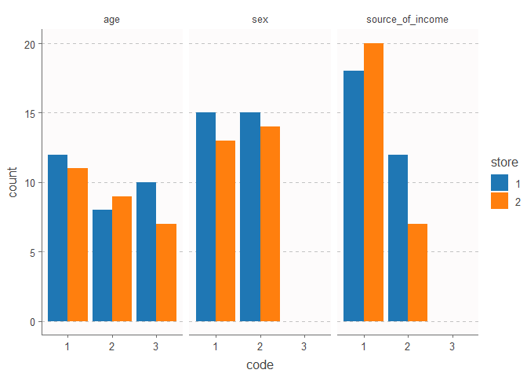
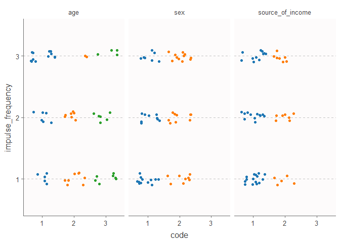

Marketing Survey Data Exploration
================
Andrew Tamalunas
10/18/2019

## Data

##### Description

The data can be found on data.world
[here](https://data.world/t-nmurthy/survey-data-on-impulsive-buying)

This is described by the person posting the data as (after editing for
better English):

" I’ve asked roughly 30 shoppers at each location the same set of
questions and requested them to help me conduct a study on impulsive
buying behavior as part of my degree program. Questions will be simple,
not very personal, and hopefully reflective of impulse buying tendency,
store environment, products, promotions which are influencing them, and
basic demographics.

The main questions \[he\] focused on:

  - Age
  - Source of income
  - Average days per month the consumer shops
  - Condideration of alternative items before their purchase
  - How often they feel like they make impulsive purchases during or
    after shopping
  - Duration of their shopping that day "

##### Goal

To examine:

  - basic demographics
  - impulse buying tendency
  - store environment
  - products and promotions which are influencing them

## Cleaning

First I loaded the `survery.csv` file of the non-aggregated data into R.

``` r
library(dplyr)

df <- read.csv('Data/survery_data.csv', header = TRUE)
glimpse(df)
```

    ## Observations: 57
    ## Variables: 11
    ## $ shopper                                                                           <int> ...
    ## $ store                                                                             <int> ...
    ## $ age                                                                               <int> ...
    ## $ sex                                                                               <int> ...
    ## $ source_of_income                                                                  <int> ...
    ## $ on_average_how_many_days_per_month_do_you_shop                                    <int> ...
    ## $ considered_or_thought_of_other_alternatives_before_purchasing_an_item             <int> ...
    ## $ how_often_do_you_feel_you_make_impulse_purchases_while_shopping_or_after_shopping <int> ...
    ## $ todays_shopping_duration                                                          <int> ...
    ## $ shopper_comments                                                                  <fct> ...
    ## $ impulsive_purchase_behaviourgrouping                                              <fct> ...

The grand total column (column\_d) is pretty unnecessary, because it’s
an addition of proportions that add to 1. So the entire column is 1’s.
The column names for columns 6-11 are pretty long, and we already have a
file for the key and all questions are related to shopping; so we should
manually rename the columns to make it easier to call them in R.

``` r
names(df)[6:11] <- c('days_per_month',
                     'consider_alts',
                     'impulse_frequency',
                     'duration_today',
                     'shopper_comments',
                     'impulse_grouping')
names(df)
```

    ##  [1] "shopper"           "store"             "age"              
    ##  [4] "sex"               "source_of_income"  "days_per_month"   
    ##  [7] "consider_alts"     "impulse_frequency" "duration_today"   
    ## [10] "shopper_comments"  "impulse_grouping"

Despite being numeric entries, some of these are categorical variables,
so I reformatted them.

``` r
change.vars <- c('store', 'age', 'sex', 'source_of_income', 'days_per_month', 'impulse_frequency')

df <- df %>% mutate_at(change.vars, as.character)
sapply(df[change.vars], class)
```

    ##             store               age               sex  source_of_income 
    ##       "character"       "character"       "character"       "character" 
    ##    days_per_month impulse_frequency 
    ##       "character"       "character"

## Basic demographics

The author’s first goal was to investigate how basic demographics
affected shopping tendencies. Before we look at the association between
impulsive shopping and the `age`, `sex`, and `source_of_income`
variables, let’s examine the demographic variables alone.

``` r
library(ggplot2); library(tidyr)
source('Graphing/tableau_theme.R')
ggthemr(tableau)
```

    ## Warning: New theme missing the following elements: axis.ticks.length.x,
    ## axis.ticks.length.x.top, axis.ticks.length.x.bottom, axis.ticks.length.y,
    ## axis.ticks.length.y.left, axis.ticks.length.y.right, plot.title.position,
    ## plot.caption.position

``` r
##### Wide to long --------------
df2 <- df %>% 
  gather(key = demographic,
         value = code,
         age:source_of_income)

##### Plot --------------
ggplot(df2) +
  geom_bar(aes(code, fill = store),
           position = 'dodge') +
  facet_grid(. ~ demographic) +
  theme(panel.grid.major.x = element_blank(),
        panel.grid.minor.x = element_blank())
```

<!-- -->

There doesn’t seem to be much information here that differentiates the
stores; there is not a (clear) difference between participant age and
sex, within or between stores, and no interactions.

The source of income is a bit more interesting. There seems to be more
individuals whose source of income comes from salary than business, with
no participant’s primary income being from family or other sources.

Now let’s look for associations between these variables and the
frequency of impulsive buying.

``` r
ggplot(df2) +
  geom_point(aes(x = code, 
                 y = impulse_frequency,
                 color = code),
             position = position_jitter(height = 0.1)) +
  facet_wrap(. ~ demographic) +
  theme(panel.grid.major.x = element_blank(),
        panel.grid.minor.x = element_blank(),
        legend.position = 'none')
```

<!-- -->

The most immediate thing that pops out as a potential association is
age. Of individuals who claim to exhibit the most frequent impulsive
buying behavior, a little over half seem to be in the youngest age
group.

We can statistically measure the strength of association between age
group and level of impulse frequency by making a contingency table and
performing a “global” chi-square test (G2-test) using log-linear
analysis from the `MASS` package.

We start by making a contingency table

``` r
library(MASS)
tabs <- xtabs(~ age + impulse_frequency, df)
tabs
```

    ##    impulse_frequency
    ## age  1  2  3
    ##   1  5  6 12
    ##   2  8  7  2
    ##   3  7  6  4

Then we construct the model

``` r
mod1 <- loglm(~ age + impulse_frequency, tabs)
mod1
```

    ## Call:
    ## loglm(formula = ~age + impulse_frequency, data = tabs)
    ## 
    ## Statistics:
    ##                       X^2 df   P(> X^2)
    ## Likelihood Ratio 8.599106  4 0.07193944
    ## Pearson          8.289173  4 0.08154164

The results suggest that age and impulse frequency are independent of
each other. When we construct the full model, however, a group size of 2
would be problematic. Let’s group them into “young adult” and “adult” by
combining age groups 26-30 and 31-35 and re-run the test.

``` r
df$age2 <- ifelse(df$age == '1', 'Young Adult', 'Adult')
tabs2 <- xtabs(~ age2 + impulse_frequency, df)

mod2 <- loglm(~ age2 + impulse_frequency, tabs2)
mod2
```

    ## Call:
    ## loglm(formula = ~age2 + impulse_frequency, data = tabs2)
    ## 
    ## Statistics:
    ##                       X^2 df   P(> X^2)
    ## Likelihood Ratio 7.775795  2 0.02048838
    ## Pearson          7.744565  2 0.02081081

That result looks a bit better, and will allow the age variable to work
as a categorical regression variable.

Now let’s look at all 3 variables in a table.

``` r
mod3 <- loglm(~ sex + impulse_frequency,
              xtabs(~ sex + impulse_frequency, df))
mod4 <- loglm(~ source_of_income + impulse_frequency,
              xtabs(~ source_of_income + impulse_frequency, df))

##### For nice table ---------------
prnt.tbl <- rbind(
  summary(mod2)[['tests']],
  summary(mod3)[['tests']],
  summary(mod4)[['tests']]
  )
prnt.tbl <- prnt.tbl[c(1,3,5),]

rownames(prnt.tbl) <- c('Age', 'Sex',  'Source of Income')

kableExtra::kable(prnt.tbl)
```

<table>

<thead>

<tr>

<th style="text-align:left;">

</th>

<th style="text-align:right;">

X^2

</th>

<th style="text-align:right;">

df

</th>

<th style="text-align:right;">

P(\> X^2)

</th>

</tr>

</thead>

<tbody>

<tr>

<td style="text-align:left;">

Age

</td>

<td style="text-align:right;">

7.775795

</td>

<td style="text-align:right;">

2

</td>

<td style="text-align:right;">

0.0204884

</td>

</tr>

<tr>

<td style="text-align:left;">

Sex

</td>

<td style="text-align:right;">

1.736885

</td>

<td style="text-align:right;">

2

</td>

<td style="text-align:right;">

0.4196046

</td>

</tr>

<tr>

<td style="text-align:left;">

Source of Income

</td>

<td style="text-align:right;">

1.004085

</td>

<td style="text-align:right;">

2

</td>

<td style="text-align:right;">

0.6052932

</td>

</tr>

</tbody>

</table>
